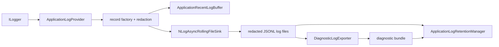

# ADR: Logging Ownership And Rolling Sink

Status: accepted for Gate 9 implementation
Decision date: 2026-07-28
Owner branch: `refactor/logging-boundary`

## Context

The current `ApplicationLogProvider` is a 715-line Core owner for unrelated responsibilities:

- Microsoft.Extensions.Logging adaptation and scope capture;
- sensitive-data redaction;
- a recent-event cache;
- bounded queueing and JSONL persistence;
- day and size rolling;
- age and total-capacity retention;
- diagnostic bundle export;
- metrics, flush and disposal.

The diagnostic exporter also copies the in-memory recent buffer instead of reading the persisted log files. That makes the buffer both a UI cache and the export source, and it prevents a diagnostic bundle from representing durable events after a process restart.

The target dependency direction requires logging implementation and sink lifecycle to belong to Infrastructure. Application code may depend only on records and the diagnostic service contract; Desktop owns presentation and process composition.

## Required Contracts

1. Redaction happens before any event reaches a queue, cache, file or export path.
2. A bounded queue cannot block UI or download threads indefinitely; overflow is counted.
3. Explicit flush drains accepted events and reports sink failure.
4. Shutdown performs a bounded asynchronous flush without `.Wait()`, `.Result` or global static state.
5. Logs roll by UTC day and configured file size.
6. Retention applies both age and a joint total-byte cap to closed log files and complete diagnostic bundles.
7. Diagnostic export reads bounded, valid redacted JSONL records from log files after flush.
8. The provider uses one private sink instance; it does not configure process-global logging.
9. Windows, Linux and macOS use the same code path.

## Evidence Before Dependency Selection

The committed `logging` system benchmark runs the production provider and records runtime, operating system, architecture, dataset, backend and commit SHA. Three same-machine quick runs at commit `26f67d7837e5dbdfe87cacd8635165876ba693cc` used .NET 10.0.10, Windows 10.0.26200, x64, 10,000 redacted events, queue capacity 2,048 and recent capacity 300.

| Metric | Observed range |
| --- | ---: |
| producer time | 323.48-395.22 ms |
| producer rate | 25,302.63-30,914.10 events/s |
| explicit flush | 4.41-11.48 ms |
| dropped events | 2,645-3,128 |
| allocation | 232.26-232.30 bytes/source event |

This is not a cross-machine performance threshold. It is reproducible evidence that the existing single-reader BCL writer loses 26-31% of a 10,000-event burst with the production queue limit. The replacement must be measured with the same scenario and metadata.

An isolated candidate spike on the same runtime and machine compared 10,000 and 100,000 event bursts. NLog's async target had substantially lower producer time and fewer drops in most rounds, but allocated more before DownKyi redaction was added. The committed production scenario, not that temporary spike, remains the long-term comparison source.

## Options

### Keep The Existing BCL Channel Sink

Advantages:

- no package dependency;
- exact flush barrier and file format are already understood;
- all privacy and retention contracts are under project control.

Rejected because the provider remains responsible for queueing and rolling internals, the burst baseline shows significant diagnostic loss, and splitting the same custom sink does not reduce long-term sink maintenance enough.

### Serilog File And Async Sinks

Serilog is maintained and supports Microsoft logging, rolling files and asynchronous wrapping. It requires separate provider, file and async packages for this use case. DownKyi would still need a pre-sink redaction adapter, total-byte retention and diagnostic export. Its async wrapper does not improve the project-specific ownership boundary enough to justify the wider package surface.

### NLog Core

NLog 6.1.4 supports .NET 10. `AsyncTargetWrapper` provides bounded asynchronous writes and a dropped-event notification. `FileTarget` supports size and time-based rolling, and `LogFactory` exposes asynchronous flush. NLog 6 also revised rolling to avoid moving the active file by default.

Selected with these restrictions:

- reference only `NLog`, not `NLog.Extensions.Logging`;
- create a private `LogFactory`; never use global `LogManager`;
- keep DownKyi's MEL provider so raw event state is redacted before NLog sees it;
- send NLog only a pre-serialized redacted JSON record;
- disable NLog retention and keep the joint project retention policy in a dedicated owner;
- treat NLog's drop event and flush callback as observable application metrics/failures.

Primary references:

- <https://www.nuget.org/packages/NLog/6.1.4>
- <https://nlog-project.org/documentation/v6.0.0/html/T_NLog_Targets_Wrappers_AsyncTargetWrapper.htm>
- <https://nlog-project.org/documentation/v6.0.0/html/Properties_T_NLog_Targets_FileTarget.htm>
- <https://nlog-project.org/2025/04/29/nlog-6-0-major-changes.html>

## Decision

Implement this ownership flow:

Contracts and logger extension methods move to Application. Provider, redactor, NLog sink, retention and exporter move to Infrastructure. Desktop constructs one Infrastructure logging runtime before Host creation, registers its `ILoggerFactory` and `IApplicationLogService`, and disposes them in order after lifecycle flush.

`ApplicationRecentLogBuffer` remains an in-process troubleshooting view only. It is not a persistence source. `DiagnosticLogExporter` flushes first, reads the newest bounded valid records from `events*.jsonl`, skips malformed lines with a counted diagnostic, and writes a manifest plus `events.jsonl`. Because the persisted input was already redacted, export never attempts to make an unsafe raw record safe after the fact.

## Verification

- Existing redaction, rotation, retention, writer failure, flush and shutdown tests move to Infrastructure and remain green.
- New tests prove secrets never reach the sink, recent buffer or export.
- New tests prove export reads persisted records after a new provider instance starts.
- New tests cover malformed JSONL, bounded newest-event selection and canceled export.
- Architecture tests reject logging implementation in Core/Desktop and reject global NLog state.
- The same `logging` system scenario records the post-change backend and metrics.
- Full strict build, tests, format, package audits, secret scan and three-platform CI must pass.

## Rollback

Revert the logging ownership commit. The log files and diagnostic bundles are non-authoritative diagnostic data, so rollback does not alter settings, SQLite, download records, partial files or resume state. Do not roll back by leaving both providers active; two sinks would duplicate events and split lifecycle ownership.
