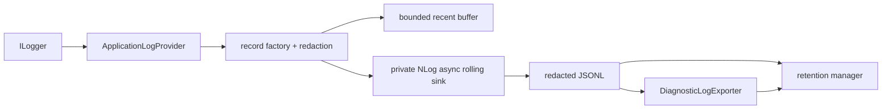

# ADR: Logging Ownership And Rolling Sink

Status: accepted and implemented.

## Decision

Application owns logging contracts；Infrastructure owns `ApplicationLogProvider`, redaction, the private NLog sink, retention and diagnostic export；Desktop composes and disposes one logging runtime. Production code depends on `ILogger<T>`／Application contracts and must not configure global logging state.

```mermaid
flowchart LR
    Logger["ILogger<T>"] --> Provider["ApplicationLogProvider"]
    Provider --> Redaction["record factory + redaction"]
    Redaction --> Recent["bounded recent buffer"]
    Redaction --> Sink["private NLog async rolling sink"]
    Sink --> Files["redacted JSONL"]
    Files --> Export["DiagnosticLogExporter"]
    Files --> Retention["retention manager"]
    Export --> Retention
```

NLog Core was selected for bounded async writes and rolling-file support, with these restrictions：

- reference `NLog`, not `NLog.Extensions.Logging`；
- use a private `LogFactory`, never global `LogManager`；
- redact into an immutable record before NLog sees the event；
- keep joint age／byte-cap retention and diagnostic export in project-owned components；
- expose drop、flush and sink failure as metrics／typed failures.

Keeping the former BCL channel sink would retain custom queue／rolling maintenance and demonstrated burst loss. Serilog would require a wider package set without removing DownKyi's redaction、retention or export owners. Historical benchmark values belong to `../performance-baseline.md` artifacts and Git, not this ADR.

## Required invariant

1. Redaction occurs before queue、recent buffer、file or export；raw sensitive data never relies on late export-time cleanup.
2. Queue and recent buffer are bounded；producer paths cannot block UI／download indefinitely, and overflow is counted.
3. Flush drains accepted events and reports the first persistence failure. Shutdown uses bounded async flush／dispose without `.Wait()`、`.Result` or fire-and-forget cleanup.
4. Files roll by UTC day and configured size. Retention applies age and one joint total-byte cap to closed logs and complete diagnostic bundles.
5. Export flushes first, then reads bounded valid redacted JSONL from persisted files；malformed lines are skipped with a count.
6. `ApplicationRecentLogBuffer` is only an in-process view, never the durable export source.
7. One private sink instance owns queue、file handles and lifecycle. A second provider／sink would duplicate events and split failure ownership.
8. Windows、Linux and macOS use the same logging path.

The sink keeps a cooperative flush barrier. Events accepted while Windows file handles reopen enter a second bounded queue and are drained before completion；the private logger configuration stays alive. Per-record writes let file-size rolling evaluate each JSONL record without moving serialization back to producer threads.

## Verification

- Infrastructure tests cover redaction、rotation、retention、writer failure、flush、shutdown、malformed JSONL、bounded export and restart export.
- Concurrency tests prove every accepted record remains valid JSON and readable after explicit flush.
- Architecture tests reject logging implementation in Core／Desktop and reject global NLog state.
- The `logging` system scenario records backend、drops、flush latency、throughput and allocation under one dataset；these metrics are a trade-off set, not isolated gates.

## Rollback

Revert the complete logging ownership change. Logs and diagnostic bundles are non-authoritative data, so rollback must not alter settings、SQLite、download records、partial files or resume state. Never leave both providers active.
